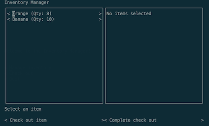

# MIST Recompete Challenge

This challenge requires submitters to develop a test plan and test automation for a terminal user interface (TUI) application,
  similar in form to the "green screen" mainframe applications used in Medicare claims processing.



The application is a simple inventory management solution supporting basic CRUD operations as well as a check out screen,
  which can be accessed over SSH.
This repository contains the application code and can be used to build and run the application via Docker/Podman.

## Challenge

Mainframe interfaces can be particularly challenging to test,
  as the primary interface mechanism is terminal access over 3270 connections.
Most of CMS' current automated mainframe tests leverage screen scraping over those 3270 connections.
This approach can be challenging:
  tests have high latency,
  structuring test code to be robust in the face of normal interface changes over time is a hard problem,
  and there are not a lot of modern frameworks or patterns to leverage.

The application presented in this challenge is significantly simpler and smaller than those used in Medicare claims processing,
  however, the general approaches and difficulties you'll encounter in testing it over SSH
  are similar to the approaches and difficulties that are encountered in testing Medicare systems over 3270 connections.

Submitters must create a test plan based on the included requirements,
  develop automated tests in an iterative software development lifecycle,
  and describe the rationale behind the decisions you've made.
Submissions must test the included application in `./app/app.py` and `Dockerfile`
  without making any modifications to either file or the initial container environment.
A `client.py` script is provided as a bare-bones example of how to connect to and interact with the application programmatically.
However, `client.py` is only an example and is not required.

While submitters aren't limited to any specific form of testing,
  the highest priority for testing is verifying that things work end-to-end,
  and so functional tests that screen-scrape the provided application's terminal interface over an SSH connection
  are expected to be a major or even primary component of the delivered solution.

## Requirements

Documentation for all requirements including any change requests is included in the [`./requirements` directory](./requirements)

## Building and Running the Application

Submitters can use the pre-built container with tools like Docker or Podman through the published image:

```
podman run -p 2222:22 -d ghcr.io/cms-oit-challenge-submissions/mist-recompete-challenge:change-request
```

Submitters can also build and run the container using the `Dockerfile` and application in this repository with the following commands:

```
podman build -t mist-challenge .
podman run -p 2222:22 -d mist-challenge

# password: password
ssh mist@127.0.0.1 -p 2222
```
